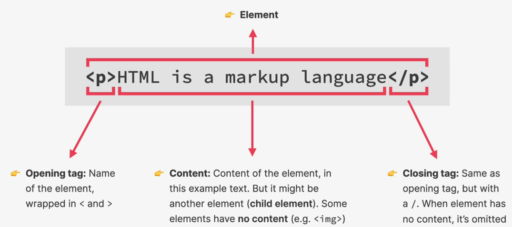

# HTML Notes

## Overview of Web Development

- Websites are written using HTML, CSS, and JavaScript. The HTML is the content of the webpage, the CSS defines how the content is displayed and the JS describes what the content can do. Combined, they make up the process of front-end development.
- Websites exist on some sort of server, where they are requested by some web browser and sent in response. These websites can exist statically, where the contents of the website are not changed, or dynamically, where the contents can be changed according to a database or other web application.
- We use back-end languages to define how dynamic websites can be updated, this process is called back-end development.

## Intro to HTML

- HTML stands for Hyper Text Markup Language
- Used to structure and describe the content of a webpage
- Is a markup language, not a programming language
- Consists of elements that describe types of content
  - Paragraphs `

`
  - Headings `<h></h>`
  - Links
  - Images
  - Videos
  - Etc
- Browsers understand HTML and render the code as a website

A+B=156

A=156-B

B=156-A

A=196-B

B=116-A

B= 2A

B= 392-2B

3B=392
